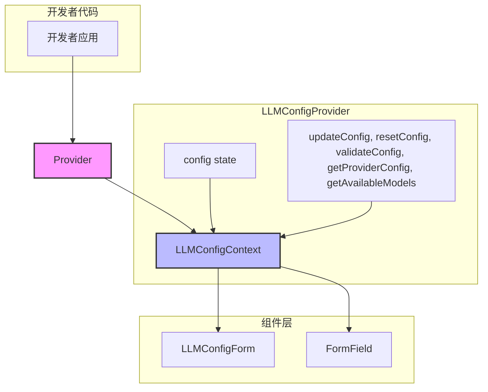
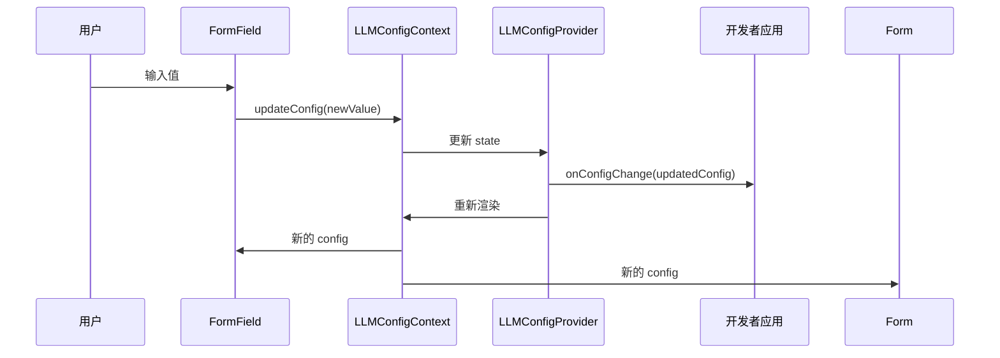
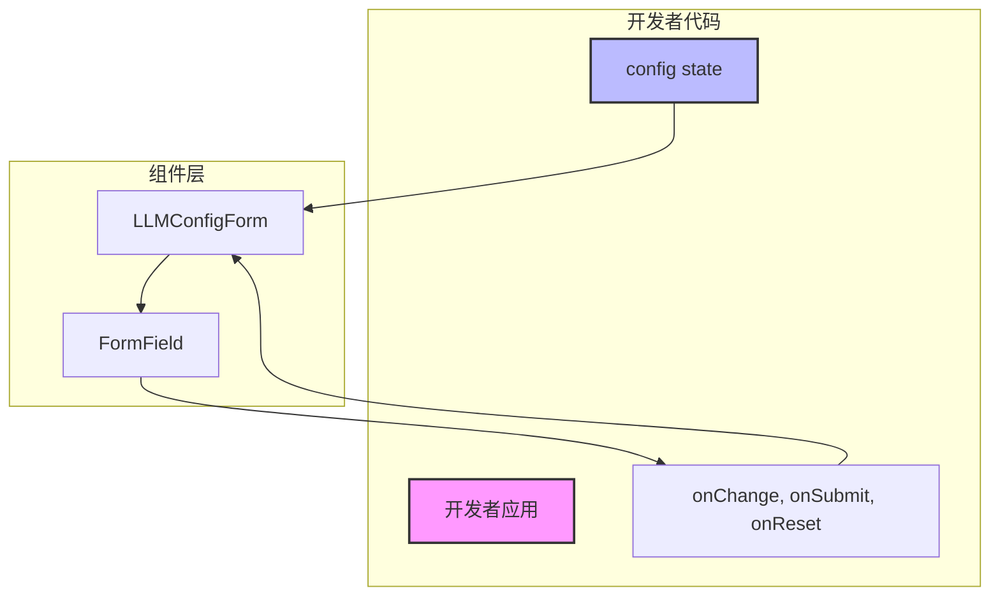
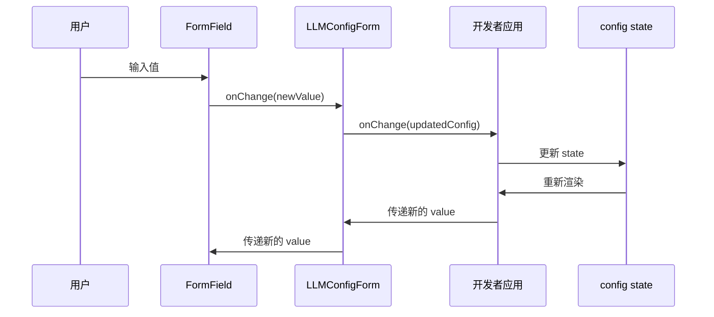
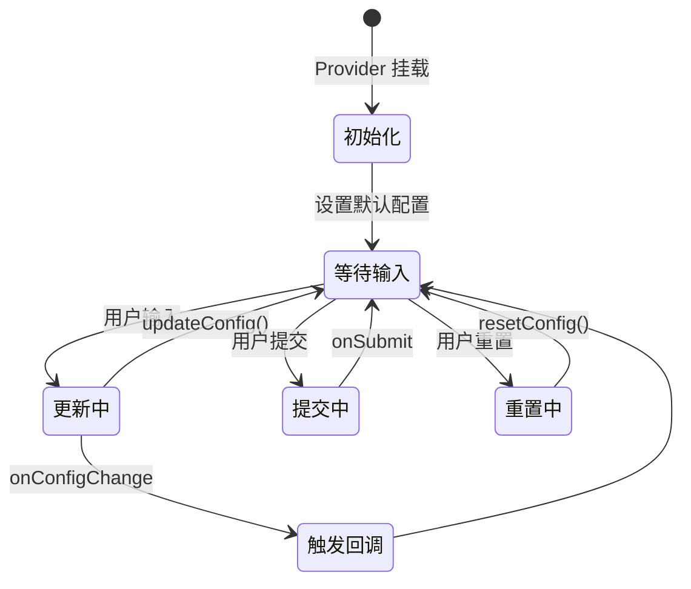
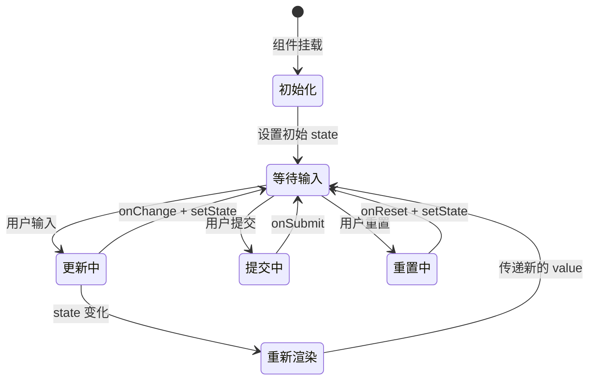
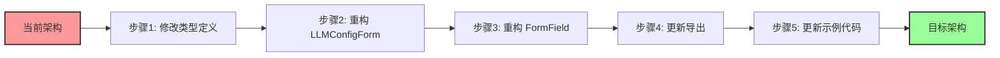

# 架构对比图

## 一、当前架构（Provider 模式）



### 数据流向



### 职责分配

| 组件 | 职责 |
|------|------|
| **LLMConfigProvider** | 状态管理、验证逻辑、Provider 配置 |
| **LLMConfigForm** | 表单布局、字段验证、提交处理 |
| **FormField** | 字段渲染、值更新 |
| **开发者应用** | 使用组件，通过回调接收变化 |

---

## 二、目标架构（受控模式）



### 数据流向



### 职责分配

| 组件 | 职责 |
|------|------|
| **开发者应用** | 状态管理、事件处理、业务逻辑 |
| **LLMConfigForm** | 表单布局、字段验证、提交处理、值传递 |
| **FormField** | 字段渲染、值更新 |

---

## 三、组件接口对比

### LLMConfigForm Props 对比

#### 当前（Provider 模式）

```typescript
interface LLMConfigFormProps {
  config: FormConfig;
  onSubmit?: (config: LLMConfig) => void | Promise<void>;
  onReset?: () => void;
  validateOnSubmit?: boolean;
  submitButtonText?: string;
  resetButtonText?: string;
  showSubmitButton?: boolean;
  showResetButton?: boolean;
  className?: string;
  progressive?: boolean;
}
```

#### 目标（受控模式）

```typescript
interface LLMConfigFormProps {
  config: FormConfig;
  value: LLMConfig;                    // 新增：受控值
  onChange?: (config: LLMConfig) => void;  // 新增：值更新回调
  providers?: ProviderConfig[];        // 新增：提供商配置
  validate?: (config: LLMConfig) => ValidationResult;  // 新增：验证函数
  onSubmit?: (config: LLMConfig) => void | Promise<void>;
  onReset?: () => void;
  validateOnSubmit?: boolean;
  submitButtonText?: string;
  resetButtonText?: string;
  showSubmitButton?: boolean;
  showResetButton?: boolean;
  className?: string;
  progressive?: boolean;
}
```

### FormField Props 对比

#### 当前（Provider 模式）

```typescript
interface FormFieldProps {
  config: FieldConfig;
  error?: string;
}

// 内部使用 Context
const { config, updateConfig } = useLLMConfig();
```

#### 目标（受控模式）

```typescript
interface FormFieldProps {
  config: FieldConfig;
  error?: string;
  value: unknown;                      // 新增：字段值
  onChange: (value: unknown) => void;  // 新增：值更新回调
  fullConfig: LLMConfig;               // 新增：完整配置
}
```

---

## 四、使用方式对比

### 当前（Provider 模式）

```tsx
function MyComponent() {
  const handleSubmit = (config) => {
    console.log('提交:', config);
  };

  return (
    <LLMConfigProvider
      defaultConfig={initialConfig}
      onConfigChange={(config) => console.log('变化:', config)}
    >
      <LLMConfigForm
        config={formConfig}
        onSubmit={handleSubmit}
      />
    </LLMConfigProvider>
  );
}
```

### 目标（受控模式）

```tsx
function MyComponent() {
  const [config, setConfig] = useState(initialConfig);

  const handleSubmit = (finalConfig) => {
    console.log('提交:', finalConfig);
  };

  const handleReset = () => {
    setConfig(DEFAULT_CONFIG);
  };

  return (
    <LLMConfigForm
      config={formConfig}
      value={config}
      onChange={setConfig}
      onSubmit={handleSubmit}
      onReset={handleReset}
    />
  );
}
```

---

## 五、状态管理对比

### 当前（Provider 模式）



### 目标（受控模式）



---

## 六、依赖关系对比

### 当前（Provider 模式）

```
开发者应用
    ↓
LLMConfigProvider (管理状态)
    ↓
LLMConfigContext (提供状态)
    ↓
LLMConfigForm (使用 Context)
    ↓
FormField (使用 Context)
```

### 目标（受控模式）

```
开发者应用 (管理状态)
    ↓ (value, onChange)
LLMConfigForm (传递 props)
    ↓ (value, onChange, fullConfig)
FormField (使用 props)
```

---

## 七、优势对比

| 方面 | Provider 模式 | 受控模式 |
|------|--------------|---------|
| **职责分离** | ❌ Provider 承担过多职责 | ✅ 组件职责清晰 |
| **状态控制** | ❌ 状态封装在 Provider 内 | ✅ 开发者完全控制 |
| **灵活性** | ❌ 难以自定义状态逻辑 | ✅ 可自由实现复杂逻辑 |
| **测试性** | ⚠️ 需要模拟 Context | ✅ 纯函数组件，易测试 |
| **集成性** | ❌ 难以与其他状态管理集成 | ✅ 易于集成 Redux/Zustand 等 |
| **学习成本** | ✅ 简单易用 | ⚠️ 需要管理状态 |
| **代码量** | ✅ 开发者代码少 | ⚠️ 需要写更多状态管理代码 |

---

## 八、迁移路径



---

## 九、总结

### 核心变化

1. **状态管理位置**
   - 从 Provider 内部 → 开发者应用

2. **数据传递方式**
   - 从 Context API → Props 传递

3. **组件职责**
   - 从"非受控" → "受控"

4. **控制力**
   - 从组件内部控制 → 开发者完全控制

### 设计原则

- **单一职责原则**：组件只负责表单渲染和验证
- **受控组件模式**：遵循 React 最佳实践
- **开发者友好**：提供最大的灵活性
- **向后兼容**：提供清晰的迁移路径
