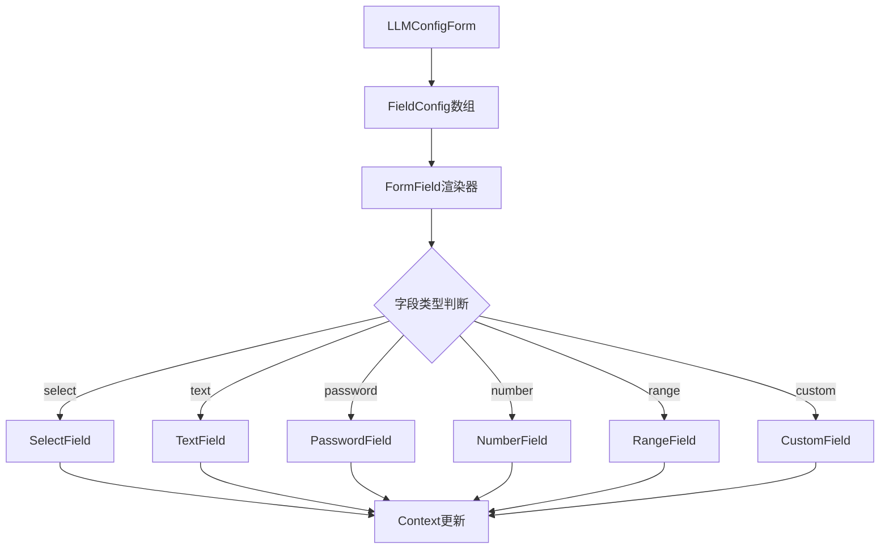

# LLM配置表单重构方案

## 当前架构分析

### 存在的问题

1. **过度组件化**
   - 每个表单字段都被拆分成独立组件（`ProviderSelector`、`AccessKeyInput`、`ModelSelector`、`TemperatureSlider`、`BaseUrlInput`等）
   - 这些组件功能简单，只是对基础UI组件的简单包装
   - 组件数量多但复用性低

2. **代码重复**
   - 每个组件都有相似的逻辑结构：
     - 从Context获取config
     - 调用updateConfig
     - 处理label、error、className等props
   - 错误处理逻辑在每个组件中重复

3. **可维护性差**
   - 添加新字段需要创建新组件文件
   - 修改字段行为需要修改多个文件
   - 字段间依赖关系难以管理

4. **灵活性不足**
   - 表单结构硬编码，难以动态生成
   - 字段顺序、显示逻辑分散在多处
   - 难以支持条件显示（如某些字段只在特定provider下显示）

5. **类型安全性弱**
   - 字段名称使用字符串，容易拼写错误
   - 缺少编译时检查

### 当前组件清单

```
components/
├── provider-selector.tsx      # Provider选择器
├── access-key-input.tsx       # API Key输入
├── model-selector.tsx         # 模型选择器
├── temperature-slider.tsx     # 温度滑块
├── base-url-input.tsx         # Base URL输入
├── connection-test-button.tsx # 连接测试按钮
├── collapsible-section.tsx    # 可折叠区域
├── form.tsx                   # 表单容器
├── provider.tsx               # Context Provider
└── types.ts                   # 类型定义
```

## 新架构设计

### 核心理念：配置驱动（Configuration-Driven）

通过声明式配置定义表单结构，而非硬编码组件。这样可以：
- 集中管理表单结构
- 动态生成表单字段
- 提高代码复用性
- 增强类型安全

### 架构概览



### 核心组件

#### 1. 字段配置类型（FieldConfig）

```typescript
export type FieldType = 
  | 'select' 
  | 'text' 
  | 'password' 
  | 'number' 
  | 'range' 
  | 'custom';

export interface BaseFieldConfig {
  name: keyof LLMConfig;
  label: string;
  type: FieldType;
  placeholder?: string;
  required?: boolean;
  disabled?: boolean | ((config: LLMConfig) => boolean);
  visible?: boolean | ((config: LLMConfig) => boolean);
  validate?: (value: any, config: LLMConfig) => string | null;
  className?: string;
}

export interface SelectFieldConfig extends BaseFieldConfig {
  type: 'select';
  options: Array<{ label: string; value: string }> | ((config: LLMConfig) => Array<{ label: string; value: string }>);
}

export interface TextFieldConfig extends BaseFieldConfig {
  type: 'text' | 'password';
}

export interface NumberFieldConfig extends BaseFieldConfig {
  type: 'number';
  min?: number;
  max?: number;
  step?: number;
}

export interface RangeFieldConfig extends BaseFieldConfig {
  type: 'range';
  min: number;
  max: number;
  step: number;
  showValue?: boolean;
}

export interface CustomFieldConfig extends BaseFieldConfig {
  type: 'custom';
  render: (props: CustomFieldRenderProps) => React.ReactNode;
}

export type FieldConfig = 
  | SelectFieldConfig 
  | TextFieldConfig 
  | NumberFieldConfig 
  | RangeFieldConfig 
  | CustomFieldConfig;

export interface FieldGroup {
  title?: string;
  collapsible?: boolean;
  defaultOpen?: boolean;
  fields: FieldConfig[];
}

export interface FormConfig {
  groups: FieldGroup[];
}
```

#### 2. 通用FormField组件

```typescript
interface FormFieldProps {
  config: FieldConfig;
  error?: string;
}

function FormField({ config, error }: FormFieldProps) {
  // 根据config.type渲染不同的输入组件
  // 统一处理label、error、disabled、visible等逻辑
}
```

#### 3. 配置驱动的LLMConfigForm

```typescript
interface LLMConfigFormProps {
  config: FormConfig;
  onSubmit?: (config: LLMConfig) => void;
  onReset?: () => void;
  // ... 其他props
}

function LLMConfigForm({ config, ...props }: LLMConfigFormProps) {
  // 遍历config.groups渲染表单
  // 根据visible条件动态显示/隐藏字段
  // 根据disabled条件动态禁用字段
}
```

### 使用示例

#### 定义表单配置

```typescript
const llmFormConfig: FormConfig = {
  groups: [
    {
      title: '基础配置',
      fields: [
        {
          name: 'provider',
          label: 'API提供商',
          type: 'select',
          required: true,
          options: [
            { label: 'OpenAI', value: 'openai' },
            { label: 'Anthropic', value: 'anthropic' },
            { label: 'Azure OpenAI', value: 'azure-openai' },
            { label: 'Google', value: 'google' },
            { label: 'Cohere', value: 'cohere' },
            { label: 'Ollama', value: 'ollama' },
          ],
        },
        {
          name: 'apiKey',
          label: 'API Key',
          type: 'password',
          required: true,
          placeholder: '输入你的 API Key',
        },
        {
          name: 'model',
          label: '选择模型',
          type: 'select',
          required: true,
          options: (config) => getAvailableModels(config.provider),
        },
      ],
    },
    {
      title: '高级选项',
      collapsible: true,
      defaultOpen: true,
      fields: [
        {
          name: 'baseURL',
          label: 'Base URL',
          type: 'text',
          placeholder: '自定义 Base URL（可选）',
        },
        {
          name: 'temperature',
          label: 'Temperature',
          type: 'range',
          min: 0,
          max: 2,
          step: 0.1,
          showValue: true,
        },
        {
          name: 'maxTokens',
          label: '最大Token数',
          type: 'number',
          min: 1,
          max: 128000,
        },
        // Azure特定字段
        {
          name: 'azureDeploymentName',
          label: '部署名称',
          type: 'text',
          visible: (config) => config.provider === 'azure-openai',
          required: (config) => config.provider === 'azure-openai',
        },
        {
          name: 'azureApiVersion',
          label: 'API 版本',
          type: 'select',
          visible: (config) => config.provider === 'azure-openai',
          required: (config) => config.provider === 'azure-openai',
          options: [
            { label: '2024-02-15-preview', value: '2024-02-15-preview' },
            { label: '2024-01-01-preview', value: '2024-01-01-preview' },
          ],
        },
      ],
    },
  ],
};
```

#### 使用表单

```typescript
<LLMConfigForm 
  config={llmFormConfig}
  onSubmit={handleSubmit}
  showSubmitButton={true}
  showResetButton={true}
/>
```

### 优势对比

| 维度 | 当前架构 | 新架构 |
|------|---------|--------|
| **组件数量** | 8+个独立组件 | 1个通用FormField + 配置 |
| **添加字段** | 创建新组件文件 | 在配置中添加定义 |
| **修改字段** | 修改组件代码 | 修改配置对象 |
| **条件显示** | 在form.tsx中硬编码 | 配置中声明visible函数 |
| **类型安全** | 字符串字段名 | keyof LLMConfig |
| **代码复用** | 低（重复逻辑多） | 高（通用渲染器） |
| **可测试性** | 需测试每个组件 | 只需测试渲染器 |
| **动态表单** | 困难 | 容易（配置可动态生成） |

## 实施计划

### 阶段1：基础架构
1. 创建新的类型定义（`form-config.ts`）
2. 实现通用FormField组件
3. 实现配置驱动的LLMConfigForm

### 阶段2：迁移现有功能
1. 将现有字段配置化
2. 测试所有字段类型
3. 保持向后兼容（可选）

### 阶段3：清理和优化
1. 删除旧的独立组件
2. 更新文档和示例
3. 性能优化

## 向后兼容策略（可选）

如果需要保持向后兼容，可以：
1. 保留旧组件作为包装器
2. 内部使用新架构实现
3. 逐步迁移使用方

```typescript
// 旧组件作为包装器
export function ProviderSelector(props: ProviderSelectorProps) {
  return (
    <LLMConfigForm config={providerFieldConfig}>
      {/* 使用新架构渲染 */}
    </LLMConfigForm>
  );
}
```

## 扩展性考虑

### 支持自定义字段类型

```typescript
{
  name: 'customField',
  label: '自定义字段',
  type: 'custom',
  render: ({ value, onChange, error }) => (
    <CustomComponent value={value} onChange={onChange} error={error} />
  ),
}
```

### 支持字段间依赖

```typescript
{
  name: 'model',
  label: '模型',
  type: 'select',
  options: (config) => {
    // 根据provider动态返回模型列表
    return getModelsByProvider(config.provider);
  },
  disabled: (config) => !config.provider,
}
```

### 支持异步验证

```typescript
{
  name: 'apiKey',
  label: 'API Key',
  type: 'password',
  validate: async (value, config) => {
    const isValid = await validateApiKey(value, config.provider);
    return isValid ? null : '无效的API Key';
  },
}
```

## 总结

新的配置驱动架构将：
- 减少70%以上的组件数量
- 提高表单的可维护性和灵活性
- 增强类型安全性
- 简化字段添加和修改流程
- 支持更复杂的表单逻辑（条件显示、字段依赖等）

这是一个更符合现代前端开发模式的方案，特别适合需要频繁调整表单结构的场景。
